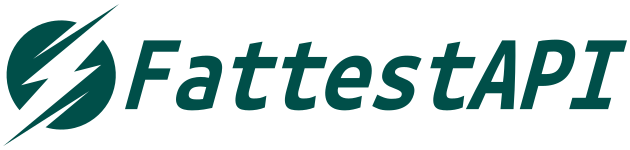

[![Contributors][contributors-shield]][contributors-url]
[![Forks][forks-shield]][forks-url]
[![Stargazers][stars-shield]][stars-url]
[![Issues][issues-shield]][issues-url]
[![MIT License][license-shield]][license-url]

<!-- PROJECT LOGO -->
 

  

<h3 align="center">FattestAPI</h3>

  

    The fattest way to develop REST APIs. based on FastAPI.
     
    <a href="https://tgoddessana.github.io/fattestapi/"><strong>Explore the docs »</strong></a>
     
  

<!---------------------------------------------------------------------------------------------->

 

## About FattestAPI

## What is it and why was it developed?

The FattestAPI package is built on top of the excellent Python web framework, FastAPI, and the widely-used
object-relational mapper, SQLAlchemy. It was developed with the goal of providing the "fattest way" to build REST APIs
by offering commonly used boilerplate code.

In fact, I was an avid fan of the Flask web framework, and I still love it. In fact, the initial name of this package
was Fullask-REST-framework, and it was developed with the intention of extending the micro web framework Flask with
batteries included.

However, while developing REST APIs using Flask, I encountered difficulties in documenting the APIs using Swagger. Of
course, you can achieve documentation using excellent frameworks like:

- Flask-Smorest, which supports OpenAPI 3.0 with Flask and marshmallow
- Flask-RESTx, which supports OpenAPI 3.0 also

And it's **definitely not**  that these packages are inadequate. But I wanted a framework that takes an even better
approach
to documentation, and that's when I came across the fantastic package, FastAPI. So, I decided to migrate the existing
framework based on FastAPI.
It was inspired by the excellent and widely-used web frameworks such as Django and Django REST Framework, Spring and
Spring Data Projects, and NestJS.

## Goals of FattestAPI

FattestAPI aims to achieve the following:

* Provide pre-built boilerplate code for commonly performed CRUD (Create, Read, Update, Delete) operations, making it
  easy for developers to handle them.
* Support Layered Architecture by officially supporting Controller, Service, and Repository, making it easier for
  developers to achieve separation of concerns.
* Support an authentication system.
* Provide commonly used utility codes.

 

## License

---

Distributed under the MIT License. See `LICENSE` for more information.

<!---------------------------------------------------------------------------------------------->

 

## Contact

---

- Email: twicegoddessana1229@gmail.com
- Project
  Link: [https://github.com/tgoddessana/FattestAPI](https://github.com/tgoddessana/FattestAPI)

<!---------------------------------------------------------------------------------------------->
<!---------------------------------------------------------------------------------------------->

<!-- MARKDOWN LINKS & IMAGES -->
<!-- https://www.markdownguide.org/basic-syntax/#reference-style-links -->

[contributors-shield]: https://img.shields.io/github/contributors/tgoddessana/FattestAPI.svg?style=for-the-badge

[contributors-url]: https://github.com/tgoddessana/FattestAPI/graphs/contributors

[forks-shield]: https://img.shields.io/github/forks/tgoddessana/FattestAPI.svg?style=for-the-badge

[forks-url]: https://github.com/tgoddessana/FattestAPI/network/members

[stars-shield]: https://img.shields.io/github/stars/tgoddessana/FattestAPI.svg?style=for-the-badge

[stars-url]: https://github.com/tgoddessana/FattestAPI/stargazers

[issues-shield]: https://img.shields.io/github/issues/tgoddessana/FattestAPI.svg?style=for-the-badge

[issues-url]: https://github.com/tgoddessana/FattestAPI/issues

[license-shield]: https://img.shields.io/github/license/tgoddessana/FattestAPI.svg?style=for-the-badge

[license-url]: https://github.com/tgoddessana/FattestAPI/blob/master/LICENSE.txt

[product-screenshot]: images/screenshot.png

[Flask]: https://img.shields.io/badge/flask-00000?style=for-the-badge&logo=flask&logoColor=white

[Python]: https://img.shields.io/badge/python-306998?style=for-the-badge&logo=python&logoColor=white

